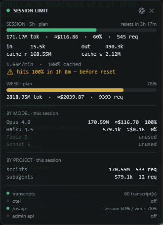

# Session Limit

An always-on-top Windows overlay that tracks how much Claude you're burning through —
live session and weekly percentages, per-model breakdown, and threshold notifications
before you run out.

WPF / .NET 8. No installer, no dependencies, single `.exe`.



---

## What it can and can't know

This matters more than the feature list, because it's the thing that shapes the whole app.

**Anthropic publishes no public API for consumer (Pro/Max) subscription quota.** There is
no endpoint that returns "you have N tokens left in this session" or "your weekly limit
resets at T". There is also no API listing active sessions or devices on your account.

So:

| | Status | How |
|---|---|---|
| Session % (5h window) | ✅ real | scraped from `claude /usage` |
| Weekly % | ✅ real | scraped from `claude /usage` |
| Tokens + cost, live | ✅ real | Claude Code transcripts / OTEL |
| Per-model breakdown | ✅ real | transcripts |
| Session reset countdown | ✅ derived | 5h from the window anchor |
| Org API billing | ✅ real | Anthropic Admin API (separate from your subscription) |
| Exact remaining quota | ❌ | not exposed anywhere |
| Weekly reset timestamp | ❌ | not exposed anywhere |
| Per-model allowance (e.g. "Fable left") | ❌ | Pro/Max quota is one shared pool, not per-model |
| Login from another location | ❌ | no API — web settings UI only |

Anything marked ❌ is genuinely unavailable, not merely unimplemented. The only way to get
it would be scraping claude.ai with your session cookie, which violates Anthropic's ToS
and breaks whenever the page changes. This app does not do that.

When real plan percentages are unavailable, the bars fall back to **your own token
budget** and the labels switch from `plan` to `budget` so you always know which you're
looking at.

---

## Data sources

Four independent collectors, each toggleable. Status dots at the bottom of the overlay
show which are live.

### 1. Transcripts (default: on)

Tails `~/.claude/projects/**/*.jsonl` and reads the `usage` object off each assistant
message — `input_tokens`, `output_tokens`, `cache_read_input_tokens`,
`cache_creation_input_tokens`, plus model and `speed`.

This is the authoritative token ledger. ⚠️ The transcript format is *internal to Claude
Code* and Anthropic warns it can change on any release, so every field is parsed
defensively: one bad line is skipped, never fatal.

### 2. `claude /usage` (default: on)

The only route to Anthropic's **real** session and weekly percentages. Shells out to the
CLI and parses the percentage bars out of its output.

Experimental by nature — it parses human-facing CLI output, so a Claude Code release could
break it. Failure is soft: the source goes red and the overlay falls back to budget mode.

The binary is auto-discovered (including the one bundled in the VS Code extension); set
`ClaudeExePath` in config to override.

### 3. OpenTelemetry (default: off)

Hosts a minimal OTLP/HTTP JSON receiver on `127.0.0.1:4318` for a live push feed of
`claude_code.token.usage` and `claude_code.cost.usage`.

Enable the checkbox, then set these environment variables before launching Claude Code:

```
CLAUDE_CODE_ENABLE_TELEMETRY=1
OTEL_METRICS_EXPORTER=otlp
OTEL_EXPORTER_OTLP_PROTOCOL=http/json
OTEL_EXPORTER_OTLP_ENDPOINT=http://localhost:4318
```

Because transcripts and OTEL describe the *same* requests, OTEL only contributes token
counts when transcripts are switched off — otherwise everything would be double-counted.
With both on, OTEL acts as a live activity signal.

### 4. Admin API (default: off)

Reads `/v1/organizations/cost_report` and `/v1/organizations/usage_report/messages` with an
admin key (`sk-ant-admin...`).

This is a **completely separate universe** from your Pro/Max subscription — it reports
pay-as-you-go API billing for a Console organization and knows nothing about session or
weekly seat quota. Useful only if you also pay per token. Shown as its own line for that
reason.

---

## Cost figures are notional

Costs are computed from published per-model list prices and shown with a `≈` prefix. On a
Pro/Max subscription **you are not billed this** — you pay a flat fee. Treat it as a
relative burn signal, not a bill.

Cache reads dominate the totals (every turn re-reads the cached prefix at ~0.1× input
price), which is why weekly token counts run into the billions.

---

## What it shows

Every panel below can be toggled independently under **Display** in settings.

| Panel | Contents |
|---|---|
| Session bar | 5h window %, reset countdown, tokens, cost, request count |
| Token split | input / output / cache read / cache write |
| Burn rate | tokens per minute, cache hit rate, and **projected time to 100%** — warns when you're on pace to exhaust the window *before* it resets |
| Weekly bar | rolling 7-day %, tokens, cost, requests |
| By model | per-model tokens, cost and share. Known-but-unused models (Fable 5, Sonnet 5, …) show a dimmed `unused` row so it's clear they're tracked — turn off with **Unused models** |
| By project | which repos are eating the window |
| Sources | live status dot per collector, plus org API billing when enabled |

The burn-rate projection is the most useful number here: percentage alone tells you where
you are, but not whether your current pace will run you out.

## Usage

Drag the header to move. `⚙` opens settings, `✕` closes.

Settings covers display toggles, which sources are on, OTEL port, admin key, token budgets,
notification thresholds, sound, always-on-top, compact mode (collapses to just the bars),
and opacity. **Apply** saves and restarts the collectors. Position and all settings persist.

Notifications fire once per threshold per window and re-arm when the window rolls over. If
you start up already past several thresholds, only the highest is announced.

---

## Build

```sh
dotnet build SessionLimit/SessionLimit.csproj
```

Self-contained single file:

```sh
dotnet publish SessionLimit/SessionLimit.csproj -c Release -r win-x64 \
  -p:PublishSingleFile=true --self-contained true
```

State lives in `%APPDATA%\SessionLimit\` — `config.json`, `state.json`, `session-limit.log`.
Deleting `state.json` forces a full re-scan of the transcript history.

---

## Performance notes

It sits on screen all day, so footprint was measured, not assumed:

- **~150 MB** steady state, **~0.3%** CPU idle.
- **0.6s** to ready on a warm start.

Three things were needed to get there, all of which were real bugs found by measuring:

- Transcripts are streamed line-by-line through a 64 KB buffer. Reading whole files
  (`ReadToEnd` + `Split`) over a ~1 GB corpus pushed the process to **4 GB**.
- Storage is tiered: raw events for the last 12h (the session window needs per-event
  timestamps), hourly per-model buckets for everything older (all the weekly total needs),
  and 64-bit hashes instead of strings for dedup keys. Keeping all ~100k events as objects
  cost ~250 MB.
- File read offsets are persisted, so a restart tails only new bytes instead of re-parsing
  the entire corpus (98,717 events → 5).

The initial backfill runs off the UI thread; window stats are cached with a 5s TTL rather
than recomputed on every 1 Hz repaint.
